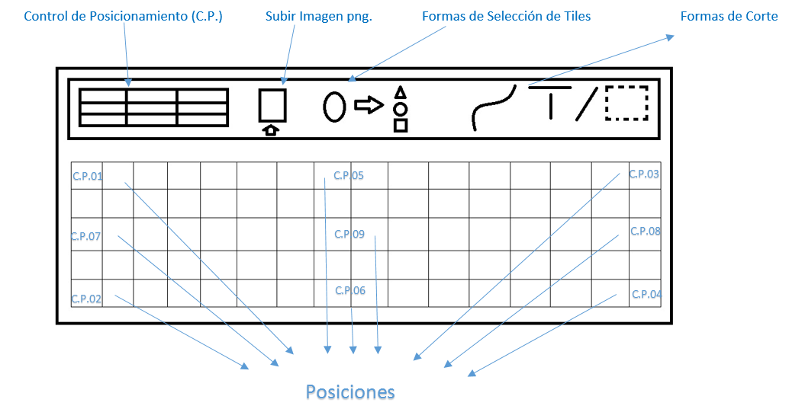
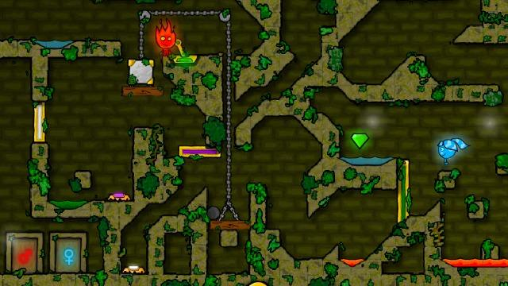

# Proyecto-de-Desarrollo-de-Herramientas

##Descripcion del Proyecto

Crear una Herramienta que sea capaz de posiconar personajes, insertar, modificar y cortar tiles para un videojuego en 2D.

## Tile Map

Nuestra Herramienta sera capaz de tilear mapas 2d para un videojuego en especifico.

- Se podra seleccionar diferentes 9 posiciones para los personajes,
- Los escenarios Tendran la mismas medida.
- Se podrá modificar la forma (cuadrado, triangulo, trapezio, rombo) sin alterar su textura.
- Se podrá modificar agregando cortes (lineas, selección cuadriculada, circular).

## Tipo de Videojuego

EL juego se llama Fire boy and Water Girl un juego de plataforma 2d donde el objetivo es que los personajes llegen a la puerta de su respectivo elemento atravesando todo tipo de obstaculos.

## Integrantes

Rojas García Paulo
Abad Pajilla Cristhian

## Screenshots

## Imagen Referencial del juego

